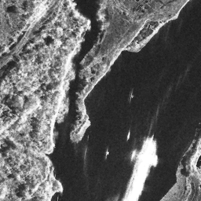
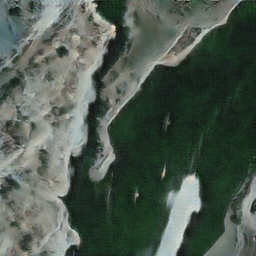
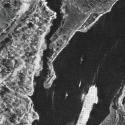
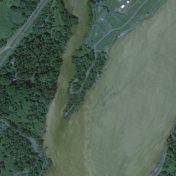
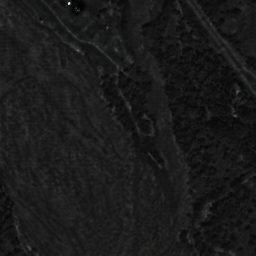
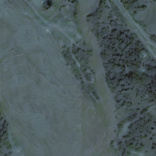

# Sar2Opt-DE-CycleGan

This repository contains an implementation of **CycleGAN** for translating SAR images to Optical images (Sar2Opt) using PyTorch.
The model is trained using **Differentiable Data Augmentation (DiffAugmentation)** to improve generalization on a limited dataset of **1450 images**.
The code supports full training, continuous training, testing, and metric evaluation (SSIM, PSNR, FID, KID).

---

## Requirements

* Python 3.10
* PyTorch
* torchvision
* Pillow (PIL)
* scikit-image
* tqdm
* pytorch-fid
* Other dependencies listed in `requirements.txt`

---

## Dataset Structure

The dataset must follow the standard CycleGAN structure:

```
Dataset/
├── trainA/       # Input domain (SAR images)
├── trainB/       # Target domain (Optical images)
├── testA/        # Test SAR images
├── testB/        # Test Optical images
```

**Training was performed on 1450 images with DiffAugmentation enabled.**

---

## Training

### Start a new training

```bash
python train.py --dataroot .\Dataset --name <experiment_name> --model cycle_gan
```

### Continue training from a previous checkpoint

```bash
python train.py --dataroot .\Dataset --name <experiment_name> --model cycle_gan --continue_train --epoch <n>
```

---

## Inference

Generate images from the test directory and save them in an HTML viewer:

```bash
python test.py --dataroot .\Dataset --name train1_cyclegan --model cycle_gan --num_test 1 --results_dir ./results/test1
```

---

## Test Mode (full dataset)

```bash
python test.py --dataroot ./datasets/sar2opt --name <experiment_name> --model cycle_gan
```

---

## Output

* Trained models → `checkpoints/<experiment_name>/`
* Generated results → `results/<experiment_name>/test_latest/`
* Images also saved in an interactive HTML page
* Evaluation images separated into `results/seprated/fakeA` and `results/seprated/realA` for metrics

---

# Metrics Evaluation (SSIM / PSNR / FID / KID)

Below are the commands and my actual results.

---

## SSIM

### Command

```bash
python metric/SSIM.py --dir_root . --fake_subdir results\seprated\fakeA --real_subdir results\seprated\realA
```

### Result

```
mean SSIM: 0.1376
```

---

## PSNR + SSIM Combined

### Command

```bash
python metric/psnr_ssim.py
```

### Result

```
SSIM Mean: 0.0877
PSNR Mean: 11.3328
```

---

## FID (pytorch-fid)

### Command (CLI)

```bash
pytorch-fid results/seprated/realA results/seprated/fakeA
```

### Result

```
FID: 108.203
```

---

## FID + KID (Custom)

### Command

```bash
python metric/fid_kid.py results/seprated/realA results/seprated/fakeA
```

### Result

```
FID: 108.3069
mean MMD^2 (KID): 0.0213
```

---

# Metrics Summary

| Metric                  | Value    |
| ----------------------- | -------- |
| **SSIM**                | 0.1376   |
| **SSIM (psnr_ssim.py)** | 0.0877   |
| **PSNR**                | 11.33 dB |
| **FID (pytorch-fid)**   | 108.20   |
| **FID (fid_kid.py)**    | 108.31   |
| **KID (mean MMD²)**     | 0.0213   |

---

# Example Results

### Real A → Fake B → Reconstructed A

| Real A                                                                      | Fake B                                                                      | Rec A                                                                     |
| --------------------------------------------------------------------------- | --------------------------------------------------------------------------- | ------------------------------------------------------------------------- |
|  |  |  |

---

### Real B → Fake A → Reconstructed B

| Real B                                                                      | Fake A                                                                      | Rec B                                                                     |
| --------------------------------------------------------------------------- | --------------------------------------------------------------------------- | ------------------------------------------------------------------------- |
|  |  |  |

---

