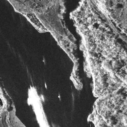
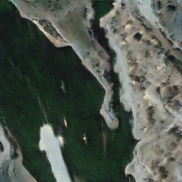
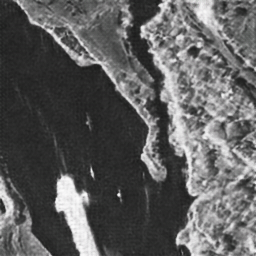
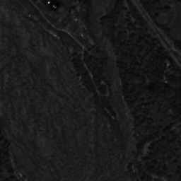
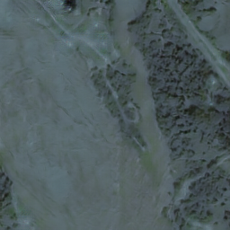

# Sar2Opt-DE-CycleGan

This repository contains an implementation of **CycleGAN** for translating SAR images to optical images (Sar2Opt) using PyTorch. The model is trained using **Differentiable Data Augmentation (DiffAugmentation)** to improve generalization on a small dataset of **1450 images**. The code supports training, continuing training, and testing/inference with visualization in HTML.

---

## Requirements

* Python 3.10
* PyTorch
* torchvision
* PIL (Pillow)
* Other dependencies as listed in `requirements.txt` 

---

## Dataset Structure

The dataset should follow the standard CycleGAN structure:

```
Dataset/
├── trainA/       # Input domain (SAR images)
├── trainB/       # Target domain (Optical images)
├── testA/        # Test input images (SAR)
├── testB/        # Test target images (Optical)
```

**Note:** This project was trained on **1450 images** using DiffAugmentation to enhance model performance with limited data.

---

## Training

### Start a new training

```bash
python train.py --dataroot .\Dataset --name <experiment_name> --model cycle_gan
```

### Continue training from a previous checkpoint

```bash
python train.py --dataroot .\Dataset --name <experiment_name> --model cycle_gan --continue_train --epoch <n>
```

---

## Inference

Generate images from a random sample in the test dataset. Results will be saved in an HTML file.

```bash
python test.py --dataroot .\Dataset --name train1_cyclegan --model cycle_gan --num_test 1 --results_dir ./results/test1
```

---

## Test Mode

Run inference on a specified dataset:

```bash
python test.py --dataroot ./datasets/sar2opt --name <experiment_name> --model cycle_gan
```

---

## Output

* Trained models are saved in the `checkpoints` directory under the experiment name.
* Generated images and visualizations are saved in the `results` directory in HTML format for easy browsing.

---

## Notes

* `--num_test` specifies the number of test images to process.
* `--continue_train` and `--epoch <n>` allow you to resume training from a specific epoch.
* `--results_dir` specifies the directory to save generated images and HTML visualizations.
* **DiffAugmentation** is applied during training to improve results with limited dataset size.

## Results

* After running inference, the following images are generated:

## Example Results

| Real A | Fake B | Reconstructed A |
|--------|--------|----------------|
|  |  |  |

| Real B | Fake A | Reconstructed B |
|--------|--------|----------------|
|  |  |  |
